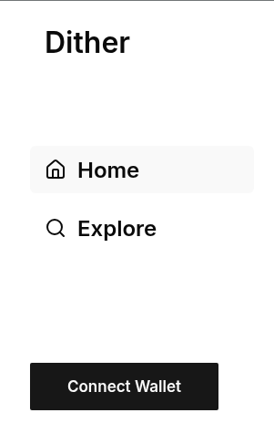
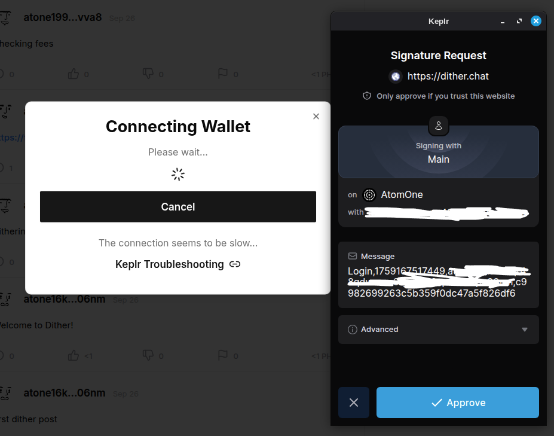
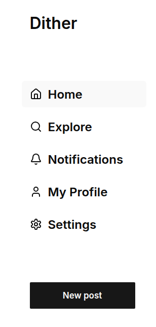
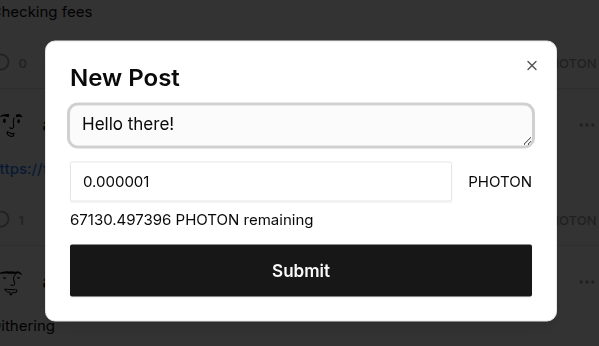

# Usage Guide

Dither lets you publish posts, replies, and reactions directly on the AtomOne blockchain. Every action is a live transaction, so you need a compatible wallet, PHOTON for fees, and a basic understanding of how the protocol works. This guide walks through setup, posting, troubleshooting, and best practices.

## Safety Notice

> [!IMPORTANT]
> Never share your mnemonic, private keys, or wallet passwords. Dither maintainers will never ask for them. Verify URLs and bot usernames before interacting—phishing attempts often imitate legitimate tooling.

## Requirements

1. **Wallet**: Keplr, Leap, or Cosmostation with AtomOne support.
2. **AtomOne address**: Provided by your wallet once the chain is enabled.
3. **PHOTON balance**: Required for posting fees. Acquire by
   - Swapping on Osmosis ([app.osmosis.zone](https://app.osmosis.zone/assets/PHOTON)), or
   - Minting from ATONE ([How to mint PHOTON](https://cogwheel.zone/blog/how-to-mint-photon)).
4. **Browser**: Chrome, Firefox, Edge (extensions) or a mobile wallet with in-app browser.

## Connect Your Wallet

1. Go to [https://dither.chat](https://dither.chat).
2. Click `Connect Wallet` in the header.
3. Choose Keplr, Leap, or Cosmostation.
4. Approve the connection request in your wallet.



## Authorize Your Session

After connecting, the site asks you to sign a one-time session message:
- Confirms you control the wallet; no funds move.
- Allows the backend to issue a short-lived JWT cookie for notifications.
- Required whenever you clear cookies or switch browsers.



> [!NOTE]
> Sessions currently last about three days. API restarts also invalidate sessions until you re-sign.

## Create a Post

1. Click `New Post`.
2. Enter up to 512 bytes of text (plain text only; link to external media if needed).
3. Press `Post`.
4. Review the transaction in your wallet, confirm the PHOTON burn, and approve.
5. Wait a few seconds for AtomOne to include the transaction. Once the reader picks it up, the post appears in the feed.




## Replies, Reactions, Follows

- **Reply**: `Reply` button → write response → approve TX (`dither.Reply(...)`).
- **Like / Dislike / Flag**: Click the corresponding icon; PHOTON amount shown under the button is burned when you sign (`dither.Like(...)`, etc.).
- **Follow / Unfollow**: Buttons on a profile issue `dither.Follow(address)` or `dither.Unfollow(address)`.

## CLI Posting (Advanced)

```bash
atomoned tx bank send \
  <from_address> \
  atone1uq6zjslvsa29cy6uu75y8txnl52mw06j6fzlep \
  1000uphoton \
  --chain-id atomone-1 \
  --fees 2500uatone \
  --memo 'dither.Post("Hello from CLI")' \
  --from <key_name>
```

Key points:
- Receiver **must** be `atone1uq6zjslvsa29cy6uu75y8txnl52mw06j6fzlep`.
- Memo must match a supported action signature (see [`protocol.md`](./protocol.md)).
- Fees are paid in ATONE (uatone); PHOTON amount is the burned tip.

## Troubleshooting

| Issue | Suggested Fix |
|-------|---------------|
| Wallet not detected | Unlock the extension; on mobile, open dither.chat inside the wallet’s in-app browser. |
| “Insufficient funds” | Ensure you have both PHOTON (for burn) and ATONE (for fees). |
| Post missing from feed | Verify the transaction on any AtomOne explorer. If it succeeded on-chain but is missing in the feed, the reader or API may be experiencing issues—check community status channels. |
| Session expires frequently | Re-sign the session message. This currently happens after deployments; a permanent fix is planned. |
| Stuck signing transaction | Re-enable the AtomOne chain in your wallet settings (e.g., Keplr → Settings → Manage Chain Visibility). |

## Best Practices

- Keep a buffer of PHOTON (e.g., 5–10 PHOTON) for reactions and replies.
- Bookmark the official fund address to avoid phishing.
- Rate limiting: the API allows roughly 10 write requests per minute per IP. Scripts should respect backoff on `429` responses.
- For moderation issues or concerns about abuse, contact the stewardship team via GitHub or community channels.

## Next Steps

- Read [`protocol.md`](./protocol.md) for memo schemas if you plan to automate postings.
- Consult [`FAQ.md`](./FAQ.md) for answers about moderation, content permanence, and wallet support.
- Review the repository [`README`](../../README.md) for architecture and operational context.