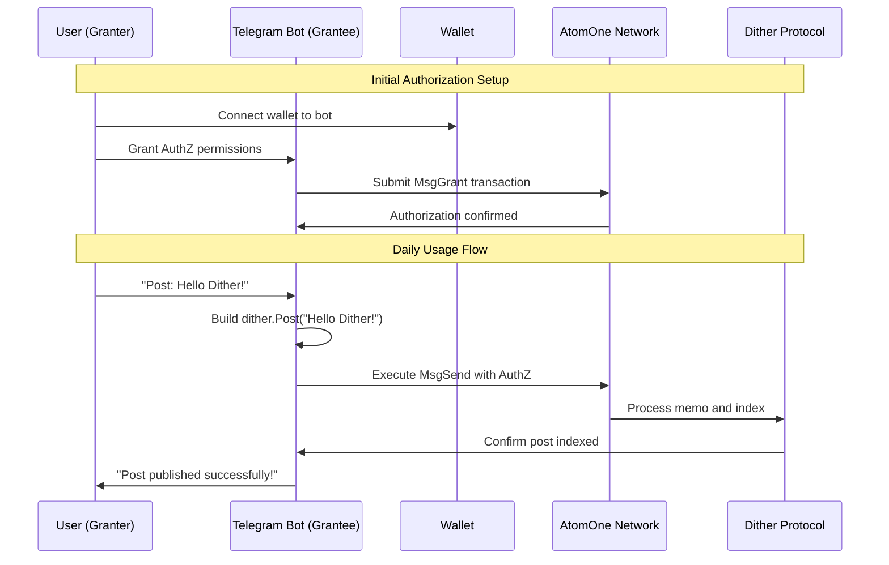

# Cosmos AuthZ Feasibility Analysis for Dither Telegram Bot

## Executive Summary

**Feasibility: HIGHLY FEASIBLE** ✅

Using Cosmos AuthZ for authority delegation in the Dither Telegram bot is not only feasible but represents an optimal solution for secure, user-controlled interactions with the Dither protocol. This approach eliminates the need for users to manually sign every transaction while maintaining full security and control.

## Technical Feasibility

### ✅ **Highly Feasible Components**

#### 1. **AuthZ Module Integration**

- **Native Support**: Cosmos AuthZ is a mature, well-documented module
- **Granular Permissions**: Perfect for Dither protocol requirements
- **Security**: Built-in security mechanisms and gas fee protections
- **Flexibility**: Supports various authorization types and constraints

#### 2. **Dither Protocol Compatibility**

- **Bank Module**: AuthZ works seamlessly with `MsgSend` (required for Dither)
- **Memo Support**: AuthZ preserves memo functionality for `dither.*` commands
- **Transaction Types**: Supports all Dither protocol actions
- **Gas Management**: Handles gas fees appropriately

#### 3. **Telegram Integration**

- **Bot API**: Telegram bots can execute AuthZ transactions
- **Mini Apps**: Web interfaces can trigger AuthZ operations
- **User Experience**: Seamless delegation without compromising security

## Implementation Architecture

### AuthZ Delegation Flow



### Supported Authorization Types

#### 1. **Send Authorization** (Primary)

```typescript
// Grant bot permission to send PHOTON with memo
const sendAuth = {
  type: "SendAuthorization",
  spendLimit: "1000000uphoton", // 1 PHOTON limit
  allowList: ["atone1uq6zjslvsa29cy6uu75y8txnl52mw06j6fzlep"], // Dither protocol address
};
```

#### 2. **Generic Authorization** (Alternative)

```typescript
// Grant bot permission for specific message types
const genericAuth = {
  type: "GenericAuthorization",
  msg: "/cosmos.bank.v1beta1.MsgSend",
};
```

## Implementation Details

### Phase 1: Basic AuthZ Integration

#### User Onboarding Flow

1. **Wallet Connection**: User connects Keplr/Leap/Cosmostation
2. **Authorization Grant**: User grants specific permissions to bot
3. **Permission Validation**: Bot validates granted permissions
4. **Ready State**: Bot can execute authorized transactions

#### Authorization Commands

```bash
# Grant Send Authorization with 1 PHOTON limit
atomoned tx authz grant cosmos1bot... send --spend-limit=1000000uphoton --allow-list=atone1uq6zjslvsa29cy6uu75y8txnl52mw06j6fzlep --from=cosmos1user...

# Grant Generic Authorization for MsgSend
atomoned tx authz grant cosmos1bot... generic --msg-type=/cosmos.bank.v1beta1.MsgSend --from=cosmos1user...
```

### Phase 2: Advanced Features

#### Permission Management

- **Permission Dashboard**: Users can view/revoke permissions
- **Spend Limits**: Configurable spending limits per authorization
- **Time Limits**: Optional expiration dates for authorizations
- **Granular Control**: Different permissions for different actions

#### Security Enhancements

- **Multi-Sig Support**: Integration with multi-signature wallets
- **Permission Auditing**: Track all delegated transactions
- **Emergency Revoke**: Instant permission revocation
- **Spend Monitoring**: Real-time spending limit tracking

## Security Analysis

### ✅ **Security Benefits**

#### 1. **User Control**

- **Granular Permissions**: Users control exactly what bot can do
- **Spend Limits**: Maximum amount bot can spend
- **Time Limits**: Optional expiration of permissions
- **Instant Revocation**: Users can revoke permissions anytime

#### 2. **No Private Key Exposure**

- **Bot Never Has Keys**: Bot operates with delegated permissions only
- **Wallet Security**: Private keys remain in user's wallet
- **Transaction Signing**: All transactions still require user approval for delegation

#### 3. **Audit Trail**

- **All Transactions Visible**: Users can see all bot actions
- **Permission History**: Track when permissions were granted/revoked
- **Spend Tracking**: Monitor actual spending vs. limits

### ⚠️ **Security Considerations**

#### 1. **Permission Scope**

- **Principle of Least Privilege**: Grant minimal necessary permissions
- **Regular Review**: Users should periodically review permissions
- **Clear Communication**: Bot should clearly explain what permissions it needs

#### 2. **Implementation Security**

- **Secure Storage**: Bot must securely store authorization details
- **Permission Validation**: Always validate permissions before execution
- **Error Handling**: Graceful handling of permission failures

## User Experience Design

### Onboarding Flow

#### Step 1: Wallet Connection

```
🔗 Connect Your Wallet

To use Dither Bot, you need to connect your Cosmos wallet and grant permissions.

Supported Wallets:
• Keplr (Recommended)
• Leap
• Cosmostation

[Connect Wallet] [Learn More]
```

#### Step 2: Permission Grant

```
🔐 Grant Permissions

The bot needs permission to post on your behalf:

✅ Send PHOTON (max 1 PHOTON)
✅ Send to Dither protocol address
✅ Include memos for dither.* commands

This allows the bot to:
• Post messages (dither.Post)
• Reply to posts (dither.Reply)
• Like posts (dither.Like)
• Follow users (dither.Follow)

[Grant Permissions] [Cancel]
```

#### Step 3: Confirmation

```
✅ Permissions Granted

Your bot is now ready to use! You can:
• Post messages without manual signing
• Like and reply to posts
• Follow other users
• Manage your permissions anytime

[Start Using Bot] [View Permissions]
```

### Daily Usage

#### Posting a Message

```
User: "Post: Hello Dither community!"

Bot: ✅ Posted successfully!
📝 "Hello Dither community!"
👤 @yourusername • Just now
💎 0.000001 PHOTON
🔗 abc123...

[👍 Like] [💬 Reply] [🔗 Share]
```

#### Permission Management

```
⚙️ Permission Settings

Current Permissions:
✅ Send PHOTON (Limit: 1 PHOTON)
✅ Send to Dither protocol
✅ Include memos

Spent This Month: 0.001 PHOTON
Remaining: 0.999 PHOTON

[Adjust Limits] [Revoke All] [View History]
```

## Technical Implementation

### Bot Backend Integration

#### AuthZ Service

```typescript
class AuthZService {
  async grantPermission(userAddress: string, botAddress: string) {
    const grantMsg = {
      type: "SendAuthorization",
      spendLimit: "1000000uphoton", // 1 PHOTON
      allowList: ["atone1uq6zjslvsa29cy6uu75y8txnl52mw06j6fzlep"],
    };

    return await this.submitTransaction({
      type: "MsgGrant",
      granter: userAddress,
      grantee: botAddress,
      authorization: grantMsg,
    });
  }

  async executeTransaction(userAddress: string, memo: string) {
    return await this.submitTransaction({
      type: "MsgExec",
      grantee: this.botAddress,
      msgs: [
        {
          type: "MsgSend",
          from: userAddress,
          to: "atone1uq6zjslvsa29cy6uu75y8txnl52mw06j6fzlep",
          amount: "1uphoton",
          memo: memo,
        },
      ],
    });
  }
}
```

#### Permission Validation

```typescript
class PermissionValidator {
  async validatePermission(userAddress: string, action: string) {
    const permissions = await this.getUserPermissions(userAddress);

    switch (action) {
      case "post":
        return permissions.canSend && permissions.spendLimit > 0;
      case "like":
        return permissions.canSend && permissions.spendLimit > 0;
      case "follow":
        return permissions.canSend && permissions.spendLimit > 0;
      default:
        return false;
    }
  }
}
```

### Mini App Integration

#### Permission Dashboard

```typescript
const PermissionDashboard = () => {
  const [permissions, setPermissions] = useState(null);
  const [spendLimit, setSpendLimit] = useState("1 PHOTON");

  const updateSpendLimit = async (newLimit: string) => {
    await authZService.updateSpendLimit(newLimit);
    setSpendLimit(newLimit);
  };

  return (
    <div className="permission-dashboard">
      <h3>Bot Permissions</h3>
      <div className="permission-item">
        <span>Send PHOTON</span>
        <span>Limit: {spendLimit}</span>
        <button onClick={() => updateSpendLimit("0.5 PHOTON")}>
          Reduce Limit
        </button>
      </div>
      <button onClick={revokeAllPermissions}>
        Revoke All Permissions
      </button>
    </div>
  );
};
```

## Comparison with Alternatives

### AuthZ vs. Manual Signing

| Aspect              | AuthZ Delegation    | Manual Signing               |
| ------------------- | ------------------- | ---------------------------- |
| **User Experience** | ✅ Seamless         | ❌ Manual approval each time |
| **Security**        | ✅ Granular control | ✅ Full user control         |
| **Convenience**     | ✅ High             | ❌ Low                       |
| **Adoption**        | ✅ High             | ❌ Low                       |
| **Complexity**      | ⚠️ Medium setup     | ✅ Simple                    |

### AuthZ vs. Private Key Storage

| Aspect           | AuthZ Delegation        | Private Key Storage |
| ---------------- | ----------------------- | ------------------- |
| **Security**     | ✅ No key exposure      | ❌ High risk        |
| **User Control** | ✅ Granular permissions | ❌ Full access      |
| **Recovery**     | ✅ Easy revocation      | ❌ Difficult        |
| **Compliance**   | ✅ Regulatory friendly  | ❌ High risk        |

## Implementation Roadmap

### Phase 1: Basic AuthZ (4-6 weeks)

- [ ] AuthZ service implementation
- [ ] Permission granting flow
- [ ] Basic transaction execution
- [ ] Permission validation
- [ ] User interface for permissions

### Phase 2: Advanced Features (4-6 weeks)

- [ ] Spend limit management
- [ ] Permission expiration
- [ ] Multi-permission support
- [ ] Permission auditing
- [ ] Emergency revocation

### Phase 3: Optimization (2-4 weeks)

- [ ] Performance optimization
- [ ] Error handling improvements
- [ ] User experience enhancements
- [ ] Security auditing
- [ ] Documentation completion

## Risk Assessment

### Low Risk ✅

- **Technical Implementation**: AuthZ is well-documented and mature
- **Security**: No private key exposure, granular permissions
- **User Adoption**: Familiar pattern for users
- **Maintenance**: Standard Cosmos module

### Medium Risk ⚠️

- **User Education**: Users need to understand permissions
- **Permission Management**: Complex permission scenarios
- **Error Handling**: Graceful handling of permission failures

### Mitigation Strategies

- **Clear Documentation**: Comprehensive user guides
- **Progressive Disclosure**: Start with simple permissions
- **Fallback Options**: Manual signing as backup
- **User Support**: Help system for permission issues

## Conclusion

**Cosmos AuthZ is the optimal solution for the Dither Telegram bot** because it:

1. **Maintains Security**: No private key exposure, granular permissions
2. **Enhances UX**: Seamless interactions without manual signing
3. **Provides Control**: Users maintain full control over permissions
4. **Enables Adoption**: Reduces friction for new users
5. **Scales Well**: Supports complex permission scenarios

The implementation is highly feasible and represents the best approach for bringing Dither to Telegram users while maintaining the security and decentralization principles of the protocol.

**Recommendation: Proceed with AuthZ implementation as the primary authorization mechanism.**
