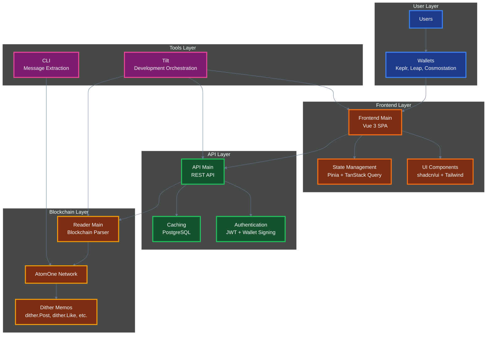
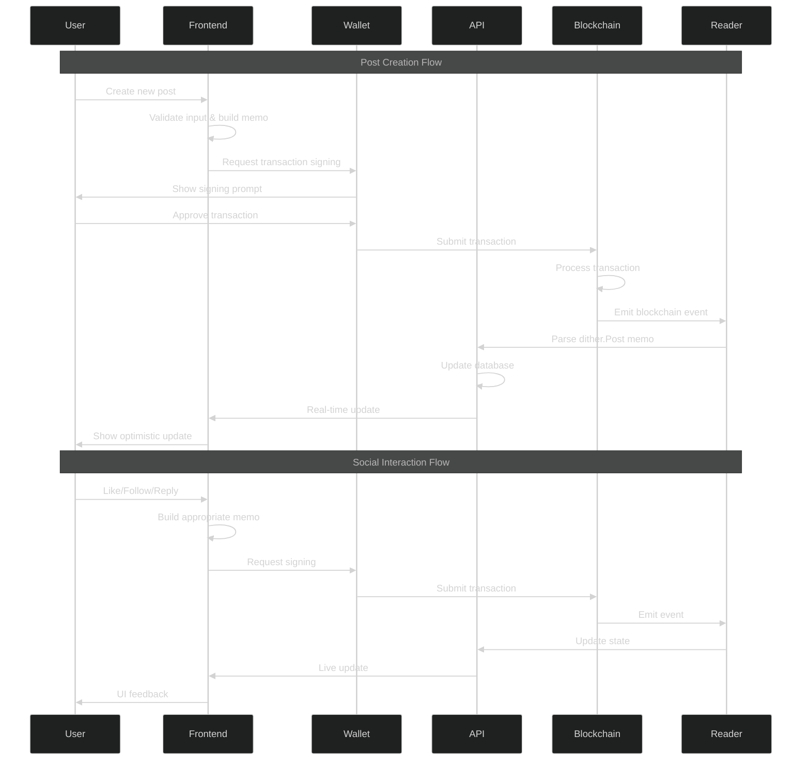

# Architecture

## Dither Protocol Integration

This frontend is part of the larger Dither ecosystem:



## Core Components

- **Frontend** (this package) - Vue 3 SPA for user interactions
- **API Main** - REST API serving post feeds and user data
- **Reader Main** - Blockchain reader parsing `dither.*` memos
- **CLI** - Command-line tool for extracting dither messages

## Core Features

- **Blockchain-first**: All actions go through Cosmos transactions via memos
- **Event-sourced**: State rebuilt from blockchain events
- **Optimistic updates**: Instant UI feedback during blockchain operations
- **Multi-wallet**: Seamless wallet switching and connection
- **Real-time**: Live updates with infinite scrolling
- **Mobile-first**: Responsive design across all devices

## Project Structure

```mermaid
%%{init: {'theme':'dark', 'themeVariables': { 'primaryColor': '#1e40af', 'primaryTextColor': '#f8fafc', 'primaryBorderColor': '#60a5fa', 'lineColor': '#64748b', 'secondaryColor': '#1e293b', 'tertiaryColor': '#334155'}}}%%
graph TD
    A[src/] --> B[components/]
    A --> C[composables/]
    A --> D[stores/]
    A --> E[views/]
    A --> F[layouts/]
    A --> G[utility/]

    B --> B1[**UI Components**]
    B --> B2[**Business Logic**]

    C --> C1[**State Hooks**]
    C --> C2[**API Integration**]

    D --> D1[**Global State**]
    D --> D2[**User Preferences**]

    E --> E1[**Page Components**]
    E --> E2[**Route Views**]

    F --> F1[**Responsive Layouts**]
    F --> F2[**Panel System**]

    G --> G1[**Helper Functions**]
    G --> G2[**Utilities**]

    classDef folder fill:#1e40af,stroke:#60a5fa,stroke-width:3px,color:#f8fafc
    classDef category fill:#7c2d12,stroke:#fb923c,stroke-width:3px,color:#f8fafc
    classDef feature fill:#166534,stroke:#4ade80,stroke-width:3px,color:#f8fafc

    class A folder
    class B,C,D,E,F,G category
    class B1,B2,C1,C2,D1,D2,E1,E2,F1,F2,G1,G2 feature
```



### Directory Overview

| Directory         | Purpose                  | Key Files                                     |
| ----------------- | ------------------------ | --------------------------------------------- |
| **components/**   | Reusable UI components   | `PostItem.vue`, `WalletConnect.vue`           |
| **composables/**  | Business logic & hooks   | `useWallet.ts`, `usePosts.ts`                 |
| **stores/**       | Pinia state management   | `useConfigStore.ts`, `useWalletStateStore.ts` |
| **views/**        | Page-level components    | `HomeView.vue`, `ProfileView.vue`             |
| **layouts/**      | Responsive layout system | `MainLayout.vue`, `MainLayoutMobile.vue`      |
| **utility/**      | Helper functions         | `atomics.ts`, `text.ts`, `toast.ts`           |
| **types/**        | TypeScript definitions   | `index.ts`                                    |
| **localization/** | i18n support             | `index.ts`                                    |

## Blockchain Integration

### User Interaction Workflow



### Dither Protocol

All interactions use the Dither protocol via blockchain memos:

```typescript
// Post creation
dither.Post('Hello, Dither!');

// Reply to post
dither.Reply('0xabc123...', 'Great post!');

// Social interactions
dither.Like('0xdef456...');
dither.Follow('cosmos1user...');

// Content moderation
dither.Flag('0xghi789...', 'spam');

// User management
dither.Unfollow('cosmos1user...');
dither.Dislike('0xjkl012...');

// Username registration and transfer to a new address
dither.RegisterHandle('handle');
dither.TransferHandle('handle', '0xabc123...');
dither.AcceptHandle('handle');

// Modify user display text
dither.SetDisplayHandle('display text');
```

### Supported Wallets

| Wallet           | Status       | Features                         |
| ---------------- | ------------ | -------------------------------- |
| **Keplr**        | Full Support | Most popular Cosmos wallet       |
| **Leap**         | Full Support | Modern wallet with great UX      |
| **Cosmostation** | Full Support | Feature-rich wallet              |
| **Address-only** | Read-only    | For viewing without transactions |

### Key Features

- **Post creation** with PHOTON token staking (minimum 0.000001 PHOTON)
- **Like/dislike** system with token burning
- **Follow/unfollow** functionality
- **Reply threading** with nested conversations
- **User tipping** and social interactions
- **Content moderation** through flagging system
- **Usernames and display text** by registering transferable handles
