# 🏗️ Architecture

## Dither Protocol Integration

This frontend is part of the larger Dither ecosystem:

```mermaid
%%{init: {'theme':'dark', 'themeVariables': { 'primaryColor': '#1e40af', 'primaryTextColor': '#f8fafc', 'primaryBorderColor': '#60a5fa', 'lineColor': '#64748b', 'secondaryColor': '#1e293b', 'tertiaryColor': '#334155'}}}%%
graph TB
    subgraph "🌐 User Layer"
        U[👤 Users]
        W[💼 Wallets<br/>Keplr, Leap, Cosmostation]
    end

    subgraph "🎨 Frontend Layer"
        F[🌐 Frontend Main<br/>Vue 3 SPA]
        UI[🎨 UI Components<br/>shadcn/ui + Tailwind]
        ST[📊 State Management<br/>Pinia + TanStack Query]
    end

    subgraph "🔗 API Layer"
        API[🚀 API Main<br/>REST API]
        AUTH[🔐 Authentication<br/>JWT + Wallet Signing]
        CACHE[💾 Caching<br/>PostgreSQL]
    end

    subgraph "⛓️ Blockchain Layer"
        BC[⛓️ AtomOne Network]
        READER[📖 Reader Main<br/>Blockchain Parser]
        MEMO[📝 Dither Memos<br/>dither.Post, dither.Like, etc.]
    end

    subgraph "🛠️ Tools Layer"
        CLI[⚡ CLI<br/>Message Extraction]
        TILT[🔄 Tilt<br/>Development Orchestration]
    end

    U --> W
    W --> F
    F --> UI
    F --> ST
    F --> API
    API --> AUTH
    API --> CACHE
    API --> READER
    READER --> BC
    BC --> MEMO
    CLI --> BC
    TILT --> F
    TILT --> API
    TILT --> READER

    classDef userLayer fill:#1e3a8a,stroke:#3b82f6,stroke-width:3px,color:#f8fafc
    classDef frontendLayer fill:#7c2d12,stroke:#f97316,stroke-width:3px,color:#f8fafc
    classDef apiLayer fill:#14532d,stroke:#22c55e,stroke-width:3px,color:#f8fafc
    classDef blockchainLayer fill:#7c2d12,stroke:#f59e0b,stroke-width:3px,color:#f8fafc
    classDef toolsLayer fill:#7c1d6f,stroke:#ec4899,stroke-width:3px,color:#f8fafc

    class U,W userLayer
    class F,UI,ST frontendLayer
    class API,AUTH,CACHE apiLayer
    class BC,READER,MEMO blockchainLayer
    class CLI,TILT toolsLayer
```



## Core Components

- **🌐 Frontend** (this package) - Vue 3 SPA for user interactions
- **🚀 API Main** - REST API serving post feeds and user data
- **📖 Reader Main** - Blockchain reader parsing `dither.*` memos
- **⚡ CLI** - Command-line tool for extracting dither messages

## Core Features

- **Blockchain-first**: All actions go through Cosmos transactions via memos
- **Event-sourced**: State rebuilt from blockchain events
- **Optimistic updates**: Instant UI feedback during blockchain operations
- **Multi-wallet**: Seamless wallet switching and connection
- **Real-time**: Live updates with infinite scrolling
- **Mobile-first**: Responsive design across all devices

## Project Structure

```mermaid
%%{init: {'theme':'dark', 'themeVariables': { 'primaryColor': '#1e40af', 'primaryTextColor': '#f8fafc', 'primaryBorderColor': '#60a5fa', 'lineColor': '#64748b', 'secondaryColor': '#1e293b', 'tertiaryColor': '#334155'}}}%%
graph TD
    A[📁 src/] --> B[🎨 components/]
    A --> C[🔧 composables/]
    A --> D[🏪 stores/]
    A --> E[📄 views/]
    A --> F[📱 layouts/]
    A --> G[⚡ utility/]

    B --> B1[**UI Components**]
    B --> B2[**Business Logic**]

    C --> C1[**State Hooks**]
    C --> C2[**API Integration**]

    D --> D1[**Global State**]
    D --> D2[**User Preferences**]

    E --> E1[**Page Components**]
    E --> E2[**Route Views**]

    F --> F1[**Responsive Layouts**]
    F --> F2[**Panel System**]

    G --> G1[**Helper Functions**]
    G --> G2[**Utilities**]

    classDef folder fill:#1e40af,stroke:#60a5fa,stroke-width:3px,color:#f8fafc
    classDef category fill:#7c2d12,stroke:#fb923c,stroke-width:3px,color:#f8fafc
    classDef feature fill:#166534,stroke:#4ade80,stroke-width:3px,color:#f8fafc

    class A folder
    class B,C,D,E,F,G category
    class B1,B2,C1,C2,D1,D2,E1,E2,F1,F2,G1,G2 feature
```



### Directory Overview

| Directory            | Purpose                  | Key Files                                     |
| -------------------- | ------------------------ | --------------------------------------------- |
| **📁 components/**   | Reusable UI components   | `PostItem.vue`, `WalletConnect.vue`           |
| **📁 composables/**  | Business logic & hooks   | `useWallet.ts`, `usePosts.ts`                 |
| **📁 stores/**       | Pinia state management   | `useConfigStore.ts`, `useWalletStateStore.ts` |
| **📁 views/**        | Page-level components    | `HomeView.vue`, `ProfileView.vue`             |
| **📁 layouts/**      | Responsive layout system | `MainLayout.vue`, `MainLayoutMobile.vue`      |
| **📁 utility/**      | Helper functions         | `atomics.ts`, `text.ts`, `toast.ts`           |
| **📁 types/**        | TypeScript definitions   | `index.ts`                                    |
| **📁 localization/** | i18n support             | `index.ts`                                    |

## 🔗 Blockchain Integration

### User Interaction Workflow


### Dither Protocol

All interactions use the Dither protocol via blockchain memos:

<details>
<summary>📝 <strong>View Protocol Examples</strong></summary>

```typescript
// Post creation
dither.Post('Hello, Dither!');

// Reply to post
dither.Reply('0xabc123...', 'Great post!');

// Social interactions
dither.Like('0xdef456...');
dither.Follow('cosmos1user...');

// Content moderation
dither.Flag('0xghi789...', 'spam');

// User management
dither.Unfollow('cosmos1user...');
dither.Dislike('0xjkl012...');
```

</details>

### Supported Wallets

<details>
<summary>💼 <strong>Wallet Compatibility</strong></summary>

| Wallet              | Status          | Features                         |
| ------------------- | --------------- | -------------------------------- |
| **🦊 Keplr**        | ✅ Full Support | Most popular Cosmos wallet       |
| **🐸 Leap**         | ✅ Full Support | Modern wallet with great UX      |
| **🏛️ Cosmostation** | ✅ Full Support | Feature-rich wallet              |
| **📖 Address-only** | ✅ Read-only    | For viewing without transactions |

</details>

### Key Features

<details>
<summary>⭐ <strong>Core Functionality</strong></summary>

- **📝 Post creation** with PHOTON token staking (minimum 0.000001 PHOTON)
- **👍👎 Like/dislike** system with token burning
- **👥 Follow/unfollow** functionality
- **💬 Reply threading** with nested conversations
- **💰 User tipping** and social interactions
- **🚩 Content moderation** through flagging system

</details>
