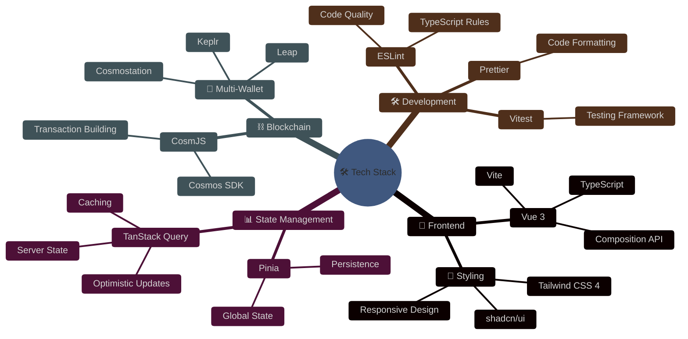
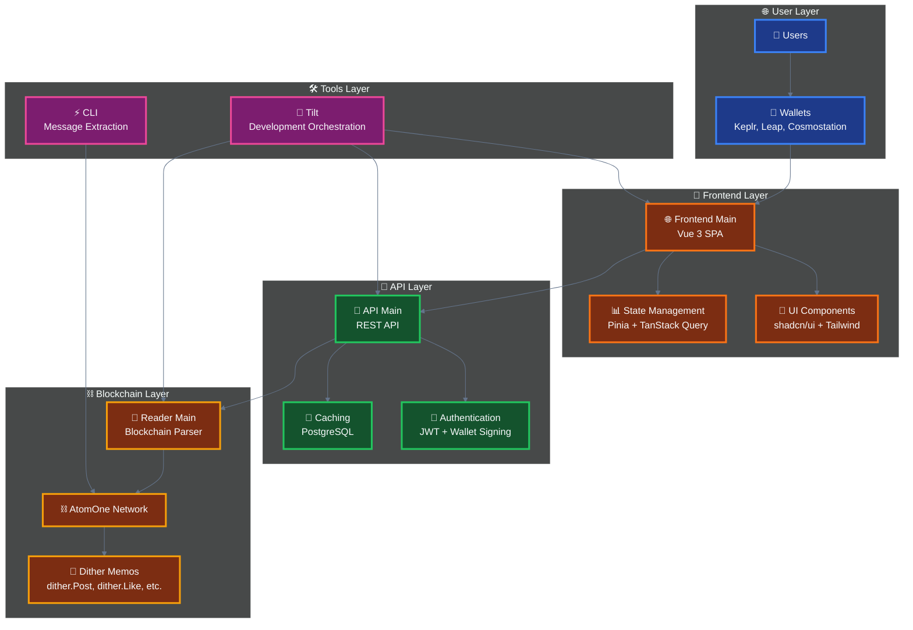
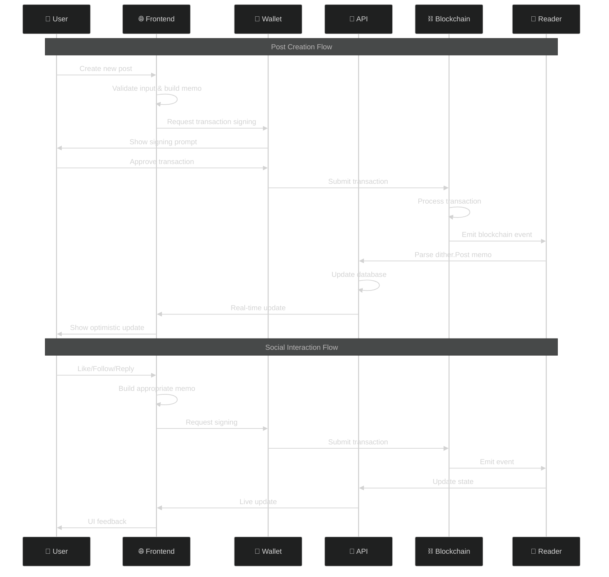

# 🌐 Dither.chat Frontend

[](https://vuejs.org/)
[](https://www.typescriptlang.org/)
[](https://tailwindcss.com/)
[](https://cosmos.network/)
[](LICENSE)

> 🚀 **A modern Vue 3 frontend for the Dither protocol** - a decentralized social media platform built for Cosmos chains (specifically AtomOne). This is the reference implementation of the Dither client, providing a complete social networking experience with blockchain-powered interactions.

## 📋 Table of Contents

- [🚀 Quick Start](#-quick-start)
- [🛠️ Tech Stack](#️-tech-stack)
- [🏗️ Architecture](#️-architecture)
- [🎨 Design System](#-design-system)
- [🔗 Blockchain Integration](#-blockchain-integration)
- [🚦 Development](#-development)
- [🌐 Environment Support](#-environment-support)
- [📱 Responsive Design](#-responsive-design)
- [🔒 Security](#-security)
- [🧪 Testing](#-testing)
- [📚 Learn More](#-learn-more)

## 🚀 Quick Start

### Prerequisites

<details>
<summary>📋 <strong>System Requirements</strong></summary>

- **Node.js** 18+ and **pnpm**
- **PHOTON tokens** on AtomOne network
- **Cosmos wallet** (Keplr, Leap, or Cosmostation)

</details>

> ⚠️ **Note**: You'll need PHOTON tokens for posting (minimum 0.000001 PHOTON per post)

### Development Setup

<details>
<summary>🛠️ <strong>Local Development</strong></summary>

```bash
# Install dependencies
pnpm install

# Start development server
pnpm dev

# Build for production
pnpm build
```

</details>

### Full Stack Development

<details>
<summary>🏗️ <strong>Complete Stack with Tilt</strong></summary>

To run the complete Dither service with all components:

```bash
# Install Tilt (https://tilt.dev)
tilt up
# Visit http://localhost:10350/ for Tilt dashboard
```

**Available Services:**

- 🌐 Frontend: `http://localhost:5173`
- 🚀 API: `http://localhost:3000`
- 📖 Reader: `http://localhost:3001`
- 🗄️ Database: `http://localhost:5432`

</details>

## 🛠️ Tech Stack



### Technology Highlights

| Category          | Technology                 | Purpose                                    |
| ----------------- | -------------------------- | ------------------------------------------ |
| **🎨 Frontend**   | Vue 3 + TypeScript         | Modern reactive framework with type safety |
| **🎨 Styling**    | Tailwind CSS 4 + shadcn/ui | Utility-first CSS with component library   |
| **📊 State**      | Pinia + TanStack Query     | Global state + server state management     |
| **⛓️ Blockchain** | CosmJS                     | Cosmos blockchain integration              |
| **💼 Wallets**    | Keplr, Leap, Cosmostation  | Multi-wallet support                       |
| **🛠️ Build**      | Vite                       | Fast development and build tooling         |
| **🧪 Testing**    | Vitest                     | Modern testing framework                   |

## 🏗️ Architecture

### Dither Protocol Integration

This frontend is part of the larger Dither ecosystem:



### Core Components

- **🌐 Frontend** (this package) - Vue 3 SPA for user interactions
- **🚀 API Main** - REST API serving post feeds and user data
- **📖 Reader Main** - Blockchain reader parsing `dither.*` memos
- **⚡ CLI** - Command-line tool for extracting dither messages

### Core Features

- **Blockchain-first**: All actions go through Cosmos transactions via memos
- **Event-sourced**: State rebuilt from blockchain events
- **Optimistic updates**: Instant UI feedback during blockchain operations
- **Multi-wallet**: Seamless wallet switching and connection
- **Real-time**: Live updates with infinite scrolling
- **Mobile-first**: Responsive design across all devices

### Project Structure

```mermaid
%%{init: {'theme':'dark', 'themeVariables': { 'primaryColor': '#1e40af', 'primaryTextColor': '#f8fafc', 'primaryBorderColor': '#60a5fa', 'lineColor': '#64748b', 'secondaryColor': '#1e293b', 'tertiaryColor': '#334155'}}}%%
graph TD
    A[📁 src/] --> B[📁 components/]
    A --> C[📁 composables/]
    A --> D[📁 stores/]
    A --> E[📁 views/]
    A --> F[📁 layouts/]
    A --> G[📁 utility/]
    A --> H[📁 types/]
    A --> I[📁 localization/]

    B --> B1[📁 posts/]
    B --> B2[📁 users/]
    B --> B3[📁 wallet/]
    B --> B4[📁 ui/]
    B --> B5[📁 notifications/]
    B --> B6[📁 popups/]
    B --> B7[📁 selects/]

    C --> C1[🔧 useWallet.ts]
    C --> C2[🔧 usePosts.ts]
    C --> C3[🔧 useAuth.ts]
    C --> C4[🔧 useNotifications.ts]

    D --> D1[🏪 useConfigStore.ts]
    D --> D2[🏪 useWalletStateStore.ts]
    D --> D3[🏪 useFiltersStore.ts]
    D --> D4[🏪 useWalletDialogStore.ts]

    E --> E1[📄 HomeView.vue]
    E --> E2[📄 ProfileView.vue]
    E --> E3[📄 PostView.vue]
    E --> E4[📄 SearchView.vue]

    F --> F1[📱 MainLayout.vue]
    F --> F2[📱 MainLayoutMobile.vue]
    F --> F3[📁 panels/]

    G --> G1[⚡ atomics.ts]
    G --> G2[⚡ text.ts]
    G --> G3[⚡ toast.ts]
    G --> G4[⚡ sanitize.ts]

    classDef folder fill:#1e40af,stroke:#60a5fa,stroke-width:3px,color:#f8fafc
    classDef file fill:#7c2d12,stroke:#fb923c,stroke-width:3px,color:#f8fafc
    classDef component fill:#166534,stroke:#4ade80,stroke-width:3px,color:#f8fafc
    classDef store fill:#92400e,stroke:#fbbf24,stroke-width:3px,color:#f8fafc
    classDef utility fill:#991b1b,stroke:#f87171,stroke-width:3px,color:#f8fafc

    class A,B,C,D,E,F,G,H folder
    class B1,B2,B3,B4,B5,B6,B7,C1,C2,C3,C4,D1,D2,D3,D4,E1,E2,E3,E4,F1,F2,F3,G1,G2,G3,G4 file
```



#### Directory Overview

| Directory            | Purpose                  | Key Files                                     |
| -------------------- | ------------------------ | --------------------------------------------- |
| **📁 components/**   | Reusable UI components   | `PostItem.vue`, `WalletConnect.vue`           |
| **📁 composables/**  | Business logic & hooks   | `useWallet.ts`, `usePosts.ts`                 |
| **📁 stores/**       | Pinia state management   | `useConfigStore.ts`, `useWalletStateStore.ts` |
| **📁 views/**        | Page-level components    | `HomeView.vue`, `ProfileView.vue`             |
| **📁 layouts/**      | Responsive layout system | `MainLayout.vue`, `MainLayoutMobile.vue`      |
| **📁 utility/**      | Helper functions         | `atomics.ts`, `text.ts`, `toast.ts`           |
| **📁 types/**        | TypeScript definitions   | `index.ts`                                    |
| **📁 localization/** | i18n support             | `index.ts`                                    |

## 🎨 Design System

- **shadcn/ui** components with custom theming
- **Dark/light mode** support
- **Responsive breakpoints** for mobile, tablet, desktop
- **Consistent spacing** and typography
- **Accessible** components with proper ARIA labels

## 🔗 Blockchain Integration

### User Interaction Workflow



### Dither Protocol

All interactions use the Dither protocol via blockchain memos:

<details>
<summary>📝 <strong>View Protocol Examples</strong></summary>

```typescript
// Post creation
dither.Post('Hello, Dither!');

// Reply to post
dither.Reply('0xabc123...', 'Great post!');

// Social interactions
dither.Like('0xdef456...');
dither.Follow('cosmos1user...');

// Content moderation
dither.Flag('0xghi789...', 'spam');

// User management
dither.Unfollow('cosmos1user...');
dither.Dislike('0xjkl012...');
```

</details>

### Supported Wallets

<details>
<summary>💼 <strong>Wallet Compatibility</strong></summary>

| Wallet              | Status          | Features                         |
| ------------------- | --------------- | -------------------------------- |
| **🦊 Keplr**        | ✅ Full Support | Most popular Cosmos wallet       |
| **🐸 Leap**         | ✅ Full Support | Modern wallet with great UX      |
| **🏛️ Cosmostation** | ✅ Full Support | Feature-rich wallet              |
| **📖 Address-only** | ✅ Read-only    | For viewing without transactions |

</details>

### Key Features

<details>
<summary>⭐ <strong>Core Functionality</strong></summary>

- **📝 Post creation** with PHOTON token staking (minimum 0.000001 PHOTON)
- **👍👎 Like/dislike** system with token burning
- **👥 Follow/unfollow** functionality
- **💬 Reply threading** with nested conversations
- **💰 User tipping** and social interactions
- **🚩 Content moderation** through flagging system

</details>

## 🚦 Development

### Code Style

<details>
<summary>📝 <strong>Development Standards</strong></summary>

- **TypeScript** strict mode
- **Composition API** with `<script setup>`
- **4-space indentation** with Prettier
- **ESLint** for code quality
- **Component composition** over inheritance

</details>

### State Management

<details>
<summary>📊 <strong>State Architecture</strong></summary>

- **Pinia** for global state (wallet, config, filters)
- **TanStack Query** for server state and caching
- **Optimistic updates** for better UX
- **Session persistence** for user preferences

</details>

### Performance

<details>
<summary>⚡ <strong>Optimization Strategies</strong></summary>

- **Infinite scrolling** with pagination
- **Lazy loading** of components
- **Bundle optimization** with tree shaking
- **Efficient re-rendering** with proper keys

</details>

## 🌐 Environment Support

<details>
<summary>🌍 <strong>Network Environments</strong></summary>

| Environment    | Network            | Purpose                | Status    |
| -------------- | ------------------ | ---------------------- | --------- |
| **🌐 Mainnet** | AtomOne Production | Live platform          | ✅ Active |
| **🧪 Testnet** | AtomOne Testnet    | Development & testing  | ✅ Active |
| **🏠 Devnet**  | Local development  | Full stack development | ✅ Active |

</details>

## 📱 Responsive Design

<details>
<summary>📱 <strong>Mobile-First Approach</strong></summary>

- **Mobile-first** approach
- **Adaptive layouts** for different screen sizes
- **Touch-friendly** interactions
- **Optimized performance** on mobile devices

</details>

## 🔒 Security

<details>
<summary>🛡️ <strong>Security Measures</strong></summary>

- **Input sanitization** and XSS prevention
- **Secure wallet** integration
- **Transaction validation**
- **Rate limiting** handling

</details>

## 🧪 Testing

<details>
<summary>🧪 <strong>Testing Strategy</strong></summary>

- **Component testing** with Vue Test Utils
- **Integration testing** for API interactions
- **Wallet connection** testing
- **Cross-browser** compatibility

</details>

## 📚 Learn More

### Dither Protocol

<details>
<summary>📖 <strong>Protocol Documentation</strong></summary>

- [Dither Protocol Documentation](./docs/guides/protocol.md)
- [Usage Guide](./docs/guides/usage.md)
- [About Dither](./docs/README.md)

</details>

### Development Resources

<details>
<summary>🛠️ <strong>External Resources</strong></summary>

- [Vue 3 Composition API](https://vuejs.org/guide/extras/composition-api-faq.html)
- [TanStack Query](https://tanstack.com/query/latest)
- [CosmJS Documentation](https://cosmos.github.io/cosmjs/)
- [Tailwind CSS](https://tailwindcss.com/docs)

</details>

### Related Packages

<details>
<summary>📦 <strong>Dither Ecosystem</strong></summary>

- [API Main](../api-main/README.md) - REST API backend
- [Reader Main](../reader-main/README.md) - Blockchain reader service
- [CLI](../cli/README.md) - Command-line tools

</details>

---

<div align="center">

**🌐 Built with ❤️ for the Cosmos ecosystem**

[](https://github.com/your-org/dither.chat)
[](https://discord.gg/dither)
[](https://twitter.com/dither_chat)

</div>
